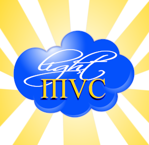

# 
# LightMVC Framework Skeleton Application

https://lightmvcframework.net

Easily create PHP applications by using any PHP library within this very modular, event-driven and Swoole-enabled framework!

## HOWTO

You can use the **LightMVC Skeleton Application** by issuing these commands:

    $ git clone https://github.com/lightmvc/lightmvcskel
    $ cd lightmvcskel
    $ composer install

> The LightMVC Skeleton Application can also be downloaded as an archive file from the https://lightmvc.net/download.

Once the previous step is done:

* Add a virtual host definition in the Apache configuration file.
* Add your database configuration to config/config.local.php,
* Load the included test database data/db_schema.sql and data/db_data.sql,
* Load the application in your favorite browser.

> Please make sure that the server can write to the cache/, logs/ and templates_c/ folders!

The **LightMVC Framework Skeleton Application** can also run on Swoole in order to make it lightning fast. In order
to do so, you must make sure to install Swoole. From the CLI, type the following:

    $ pecl install swoole

After answering a few questions, Swoole will be compiled and installed. Then, run the following command (on Linux/Unix/Mac):

    $ echo "extension=swoole.so" >> /etc/php.ini

> If running Swoole on Windows, please add the extension manually in **PHP**'s php.ini file.

Then, from within the root directory of the project, you can run the following command:

    $ composer run-swoole

> By default, Swoole will listen on the ``localhost`` loopback, on port 9501. If you wish to change this, please modify the ``run-swoole`` command inside the ``composer.json`` file according to your needs.

### Have a lot of fun! :)